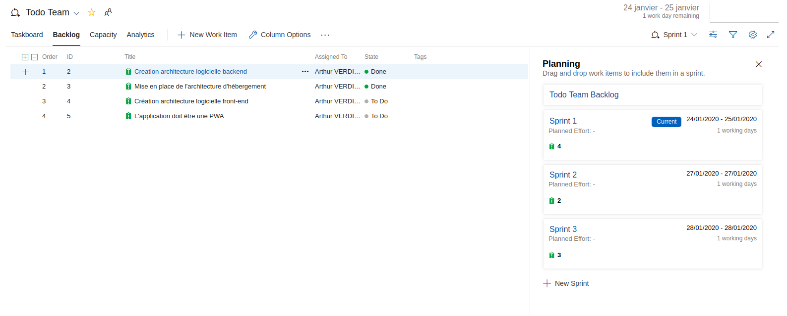
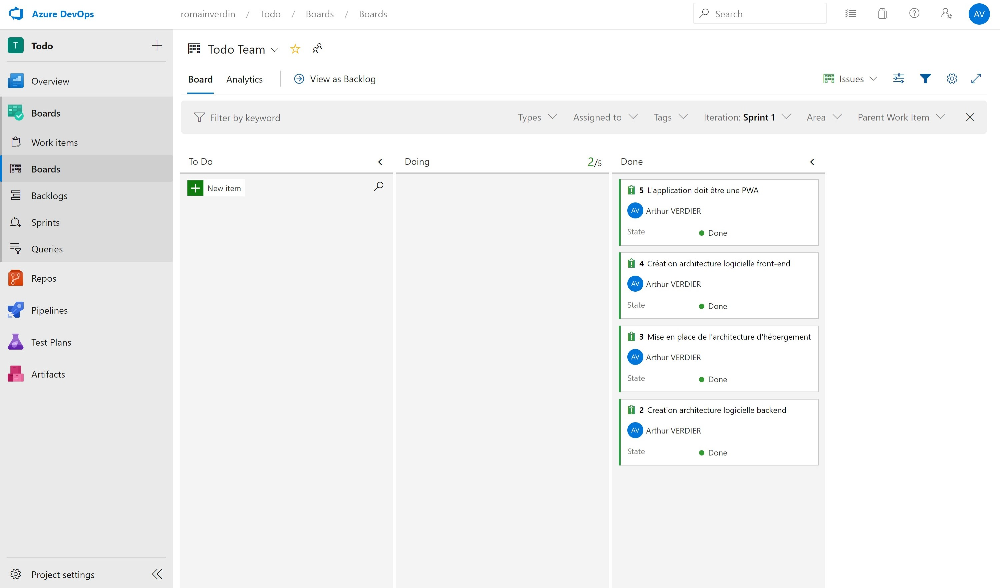
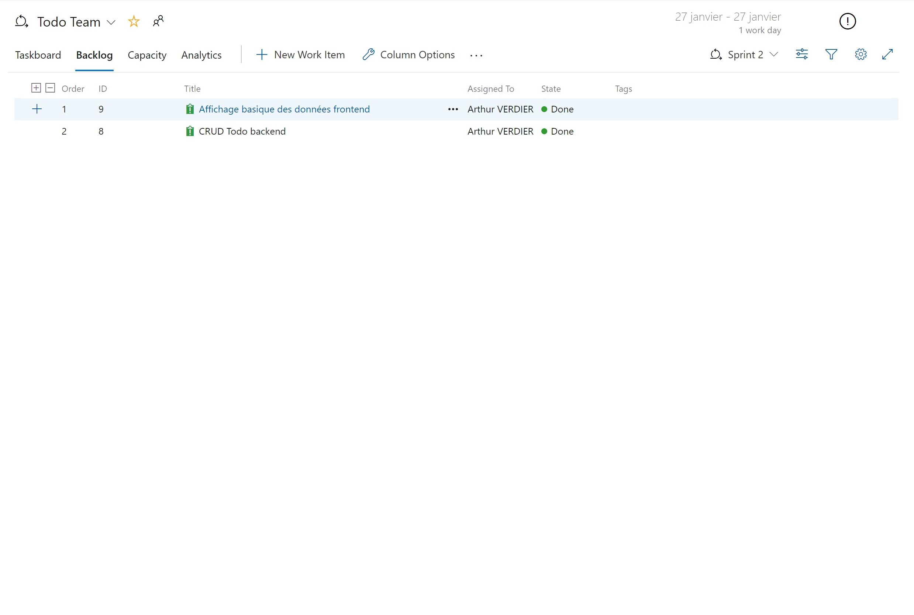
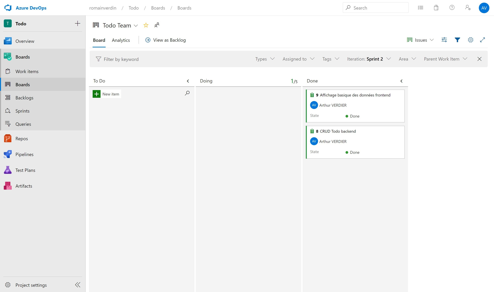

# Enigma | Scrum | Todo backend

## Installation

Clone project
```
git clone git@github.com:averdier/enigma_scrum_todo_backend.git
```

Install python requirements
```
python3 -m venv env

source env/bin/activate
pip install -r requirements.txt
```

Install serverless requirments
```
npm i
```

## Configuration

| Key             | Description               | Required | Default                          |
|-----------------|---------------------------|----------|----------------------------------|
| ADMINS          | Administrators email      | False    | arthur.verdier@enigma-school.com |
| APP_CONFIG      | Application configuration | False    | dev                              |
| ENV             | Flask configuration       | False    | development                      |
| SECRET_KEY      | Application secret key    | False    | Random key                       |
| NAME            | Application name          | False    | enigma_scrum_backend             |
| PROVIDER_REGION | AWS region provider       | False    | eu-central-1                     |
| TODO_TABLE      | DynamoDB todo table       | True     |                                  |
| TODO_PER_PAGE   | Todo per page             | False    | 35                               |

## Sprint

## Sprint 01





## Sprint 02




